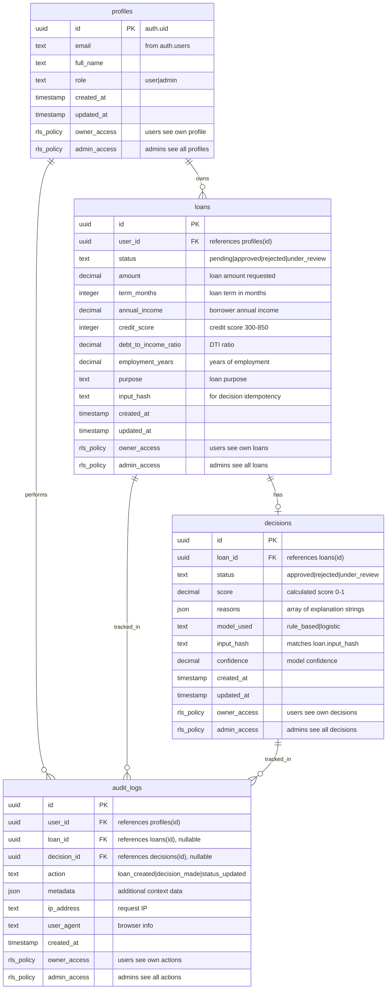

# Database Entity Relationship Diagram (ERD)

## Schema Overview
The AI Loan Approval System uses a PostgreSQL database hosted on Supabase with comprehensive Row Level Security (RLS) policies.

## Core Entities

### profiles
- **Purpose**: User management with role-based access
- **Key Features**: Links to Supabase auth.users, supports admin roles
- **RLS**: Users access own profile, admins access all

### loans
- **Purpose**: Loan application data and status tracking
- **Key Features**: Complete borrower information, status workflow
- **RLS**: Owner-only access with admin override
- **Relationships**: Belongs to user, has one decision

### decisions
- **Purpose**: AI scoring results and explanations
- **Key Features**: Score, reasons, model tracking, confidence
- **RLS**: Tied to loan ownership via foreign key
- **Relationships**: Belongs to loan, tracked in audit logs

### audit_logs
- **Purpose**: Complete action tracking for compliance
- **Key Features**: User actions, IP tracking, metadata
- **RLS**: Users see own actions, admins see all
- **Relationships**: Links to users, loans, and decisions

## Security Model

### Row Level Security (RLS)
- **Owner Access**: `user_id = auth.uid()` for user data isolation
- **Admin Access**: `profiles.role = 'admin'` for administrative override
- **Audit Trail**: All actions logged with user context
- **Data Isolation**: No cross-user data leakage possible

### Indexes & Performance
- Primary keys on all entities (UUID)
- Foreign key indexes for relationships
- Compound indexes on frequently queried fields
- Input hash for decision idempotency

## Business Rules
- One decision per loan (1:1 relationship)
- All actions audited (comprehensive logging)
- Soft deletes via status fields
- Immutable decision records
- Time-based decision intervals
